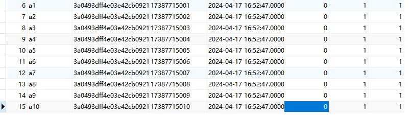

### 用户信息
##### 模拟测试用户
ab~ag  
密码：123456  
sql函数批量添加模拟用户
```sql
CREATE DEFINER=`root`@`%` PROCEDURE `add_user`(IN num INT)
BEGIN
  DECLARE i INT DEFAULT 1;
  WHILE i <= num DO
    INSERT INTO app_user (username, password, phonenumber, createtime,role_id, subadmin, process)
    VALUES (CONCAT('a', i), '3a0493dff4e03e42cb0921371f077a0f', '17387715000'+i, '2024-04-17 16:52:47.000000','1', '1', '1');
    SET i = i + 1;
  END WHILE;
END
```

#### 信息测试，添加数据用
密码：123456  
- 用户名：账号
- Mdoum :17387715045 --用户
- zlw :13150607296 --管理员
- ma :17387715047 --商家

